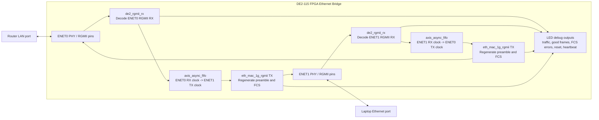
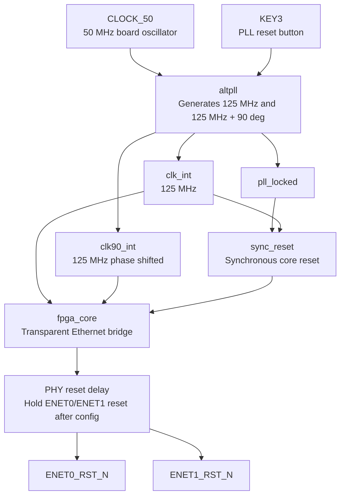
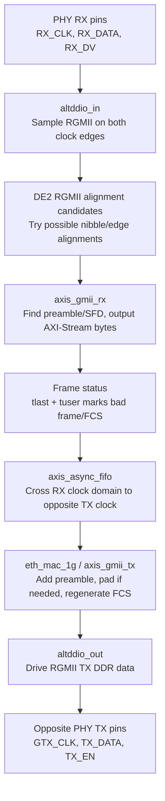
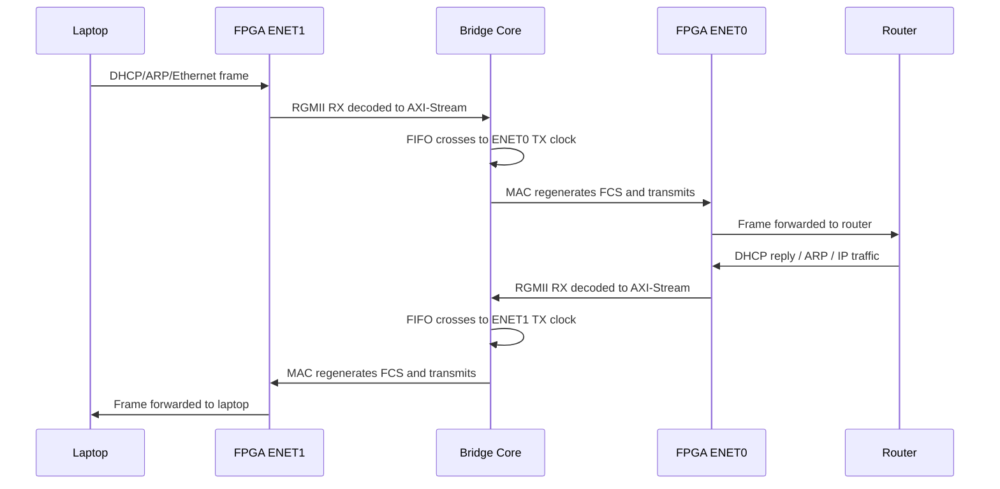
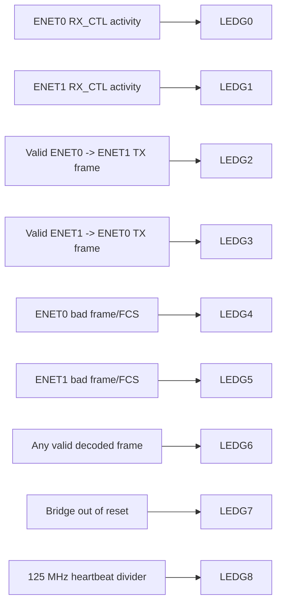

# Code Flowchart: FPGA Ethernet Bridge

This document shows how the active FPGA bridge code works. It focuses on the
current working board build, not the older firewall modules that remain in the
repository for reference.

## Top-Level System Flow

## Board Top Flow

## Per-Direction Frame Flow

The bridge is symmetric. The same logic exists in both directions.

## Runtime Packet Sequence

This is what happens when the laptop gets internet access through the FPGA.

## LED Debug Flow

## File-To-Function Map

| File | Role in the flowchart |
| --- | --- |
| `rtl/fpga.v` | Board top, PLL, reset synchronization, physical pin wiring |
| `rtl/fpga_core.v` | Main bridge logic and LED/debug status |
| `rtl/de2_rgmii_rx.v` | RGMII DDR receive alignment and frame decode |
| `rtl/axis_async_fifo.v` | Clock-domain crossing between RX and opposite TX |
| `verilog-ethernet/rtl/eth_mac_1g__rgmii.v` | RGMII MAC wrapper used for transmit |
| `verilog-ethernet/rtl/eth_mac_1g.v` | Ethernet MAC TX/RX frame logic |
| `verilog-ethernet/rtl/axis_gmii_rx.v` | Converts GMII bytes into AXI-Stream frames |
| `verilog-ethernet/rtl/axis_gmii_tx.v` | Converts AXI-Stream frames into GMII transmit bytes |
| `verilog-ethernet/rtl/rgmii_phy_if.v` | Converts between GMII and RGMII DDR pins |
| `verilog-ethernet/rtl/oddr.v` | DDR output wrapper for RGMII TX |
| `verilog-ethernet/rtl/ssio_ddr_in.v` | DDR input wrapper for RGMII RX |

## Short Explanation For Documentation

The FPGA is configured as an inline Ethernet bridge. Each Ethernet PHY provides
RGMII receive data to the FPGA. The receive logic samples both RGMII clock
edges, aligns the nibbles into bytes, checks the Ethernet frame, and emits an
AXI-Stream frame. An async FIFO transfers that frame into the opposite port's
transmit clock domain. The transmit MAC then rebuilds the Ethernet transmit
stream, including preamble and FCS, and drives the opposite RGMII PHY. The same
path exists in reverse, so the router and laptop can exchange DHCP, ARP, DNS,
ICMP, and normal IP traffic through the FPGA.
