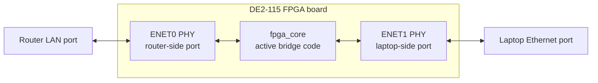
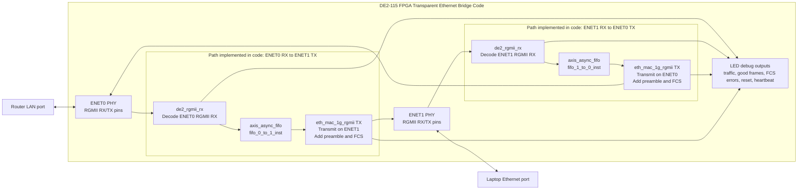
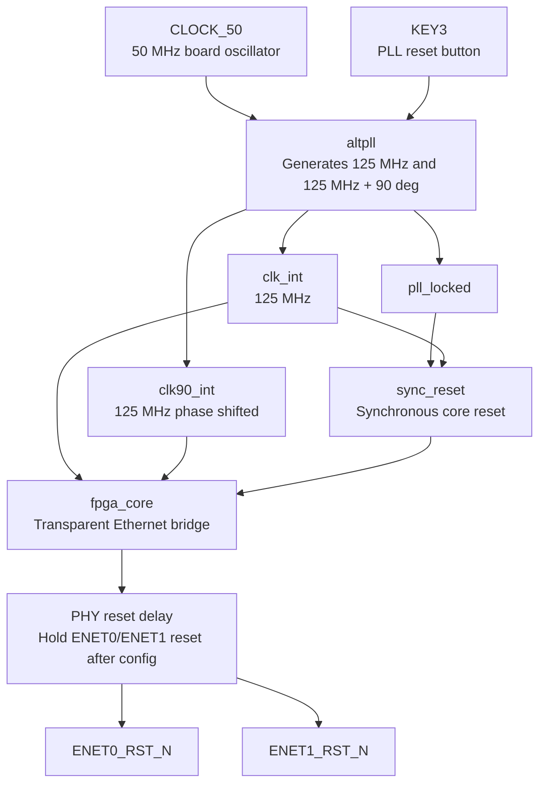
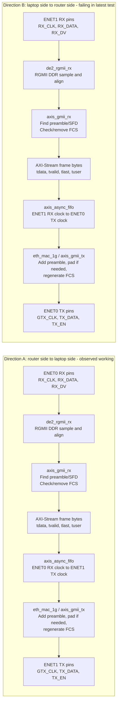
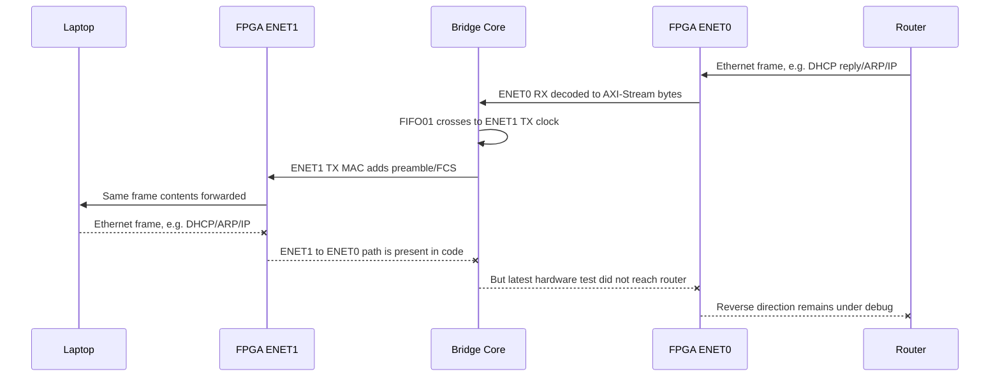
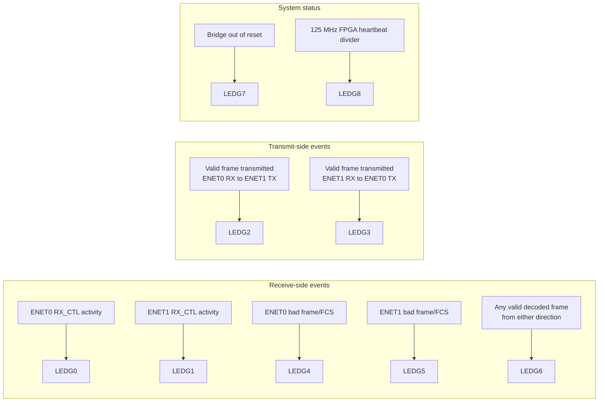

# Code Flowchart: FPGA Ethernet Bridge

This document shows how the active FPGA bridge code works. It focuses on the
current working board build, not the older firewall modules that remain in the
repository for reference.

Important hardware note: the active Verilog instantiates two mirrored forwarding
paths for the intended transparent bridge. In the latest board test, router
traffic reached the laptop, but laptop traffic did not reach the router. The
top-level diagram below shows the intended bidirectional bridge; the later
runtime packet sequence documents the currently observed hardware behavior.

## Top-Level Bidirectional System Flow

## Implemented Code Structure

## Board Top Flow

## Intended Bidirectional Frame Flow In Code

The active Verilog contains two mirrored one-way hardware paths. The first path
has been observed working in the latest test. The second path exists in the code
but is the path to debug because laptop-to-router traffic is not reaching the
router.

## Runtime Packet Sequence

This is the latest observed behavior with the normal cabling:
router on ENET0 and laptop on ENET1.

## LED Debug Flow

## File-To-Function Map

| File | Role in the flowchart |
| --- | --- |
| `rtl/fpga.v` | Board top, PLL, reset synchronization, physical pin wiring |
| `rtl/fpga_core.v` | Main bridge logic and LED/debug status |
| `rtl/de2_rgmii_rx.v` | RGMII DDR receive alignment and frame decode |
| `rtl/axis_async_fifo.v` | Clock-domain crossing between RX and opposite TX |
| `verilog-ethernet/rtl/eth_mac_1g__rgmii.v` | RGMII MAC wrapper used for transmit |
| `verilog-ethernet/rtl/eth_mac_1g.v` | Ethernet MAC TX/RX frame logic |
| `verilog-ethernet/rtl/axis_gmii_rx.v` | Converts GMII bytes into AXI-Stream frames |
| `verilog-ethernet/rtl/axis_gmii_tx.v` | Converts AXI-Stream frames into GMII transmit bytes |
| `verilog-ethernet/rtl/rgmii_phy_if.v` | Converts between GMII and RGMII DDR pins |
| `verilog-ethernet/rtl/oddr.v` | DDR output wrapper for RGMII TX |
| `verilog-ethernet/rtl/ssio_ddr_in.v` | DDR input wrapper for RGMII RX |

## Short Explanation For Documentation

The active Verilog is intended to implement an inline transparent Ethernet
bridge. `fpga_core.v` instantiates two mirrored forwarding paths: ENET0 RX goes
through `fifo_0_to_1_inst` to ENET1 TX, and ENET1 RX goes through
`fifo_1_to_0_inst` to ENET0 TX. In the latest hardware test, only the
router-side to laptop-side direction was confirmed working. The laptop-side to
router-side direction is present in the code but did not reach the router and
must be debugged as the `ENET1 RX -> fifo_1_to_0_inst -> ENET0 TX` path. The
frame contents are forwarded as a byte stream; the active bridge does not parse
or filter MAC/IP/TCP/UDP fields.
